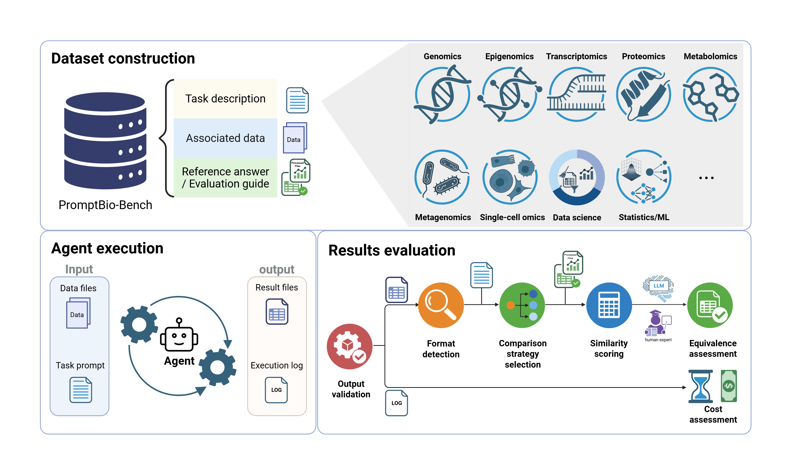

# promptbio-bench

[](https://promptbio.github.io/promptbio-bench) [](https://github.com/promptbio/promptbio-bench) [](https://doi.org/10.64898/2026.05.05.723092) [](https://huggingface.co/datasets/promptbio-ai/promptbio-bench-data)

This repository contains the evaluation framework for [PromptBio-bench](https://doi.org/10.64898/2026.05.05.723092), a benchmark of 244 tasks spanning bioinformatics and data science. Given a task and an agent output directory, it runs a 4-step LLM-assisted pipeline to score how well the output matches the reference answer.

<p align="center">
  
</p>

--- 

## Prerequisites

- Conda (Miniconda or Miniforge3)
- OpenAI API key (`OPENAI_API_KEY`)

## Quick start

### 1) Create and activate the environment

```bash
conda env create -f environment.yml
conda activate eval
```

### 2) Set your API key

Create a `.env` file at the project root:

```bash
echo "OPENAI_API_KEY=sk-..." > .env
```

The key is loaded automatically by `utils/agents.py` via `python-dotenv`.

### 3) Run an evaluation

Single agent:

```bash
python run_eval.py \
  --task-dir   <path/to/task> \
  --result-dir <path/to/agent/output> \
  --output-dir <path/to/save/results> \
  --label      <agent_name> \
  --model      gpt-5.4
```

Multiple agents (Steps 2 & 3 run only once):

```bash
python run_eval.py \
  --task-dir   <path/to/task> \
  --result-dir <path/to/agent1>,<path/to/agent2>,<path/to/agent3> \
  --label      agent1,agent2,agent3 \
  --output-dir <path/to/save/results>
```

---

## CLI reference

### Arguments

| Argument | Required | Description |
|---|---|---|
| `--task-dir` | yes | Task directory containing `task.json`, `eval.json`, and `ref_answer/` |
| `--result-dir` | yes | Comma-separated agent result directories to evaluate |
| `--output-dir` | yes | Directory where comparison results and logs will be saved |
| `--label` | no | Comma-separated labels for output filenames, one per `--result-dir` (default: `agent`). If a single label is given for multiple result dirs, it is auto-suffixed with `_0`, `_1`, … |
| `--model` | no | LLM for matching, strategy recommendation, and comparison (default: `gpt-5.4`) |

### Output files

One set of files per agent is saved to `--output-dir`:

| File | Description |
|---|---|
| `<task_id>_<label>.log` | Full pipeline log |
| `<task_id>_<label>.json` | Per-file similarity scores and status |
| `<task_id>_<label>_full.json` | Full intermediate state for debugging |

--- 

## Pipeline overview

Each evaluation runs four steps:

1. **Match** — LLM maps agent output files to reference files. *(per agent)*
2. **Detect** — identify the format of each reference file. *(shared — runs once)*
3. **Recommend** — LLM chooses comparison strategy + parameters per file. *(shared — runs once)*
4. **Compare** — compute similarity (0–1) for each file pair. *(per agent)*

Steps 2 and 3 only look at the reference files and the question — never at
agent output — so their results are valid for every agent. When multiple
`--result-dir` paths are supplied, they run once and are reused for each
agent's Match/Compare pass, reducing cost and latency.

Final score is the average similarity across all scored reference files.

## Task data and directory structure

Tasks can be downloaded from Hugging Face: [promptbio-ai/promptbio-bench-data](https://huggingface.co/datasets/promptbio-ai/promptbio-bench-data).

Each task is stored in a directory named by its task ID. The directory (passed via `--task-dir`) should look like:

```text
<task-dir>/
├── task.json        # Task definition shown to the agent
├── eval.json        # Evaluation spec used by run_eval.py
├── ref_answer/      # Reference output files
│   └── A375_WGS_WMG.cnv.vcf.gz.tbi
├── ref_script/      # Reference solution scripts (not used by evaluator)
│   └── work.sh
└── data/            # Input files provided to the agent (optional)
    └── A375_WGS_WMG.cnv.vcf.gz
```

### `task.json` example

```json
{
  "id": "a-1-2",
  "question": "Please generate a tabix index for the provided VCF.gz file.",
  "input_files": ["data/A375_WGS_WMG.cnv.vcf.gz"],
  "expected_output": [
    {"file": "A375_WGS_WMG.cnv.vcf.gz.tbi", "type": "tbi", "description": ""}
  ],
  "timeout_seconds": 3600
}
```

### `eval.json` example

```json
{
  "id": "a-1-2",
  "question": "Please generate a tabix index for the provided VCF.gz file.",
  "ref_answer": ["ref_answer/A375_WGS_WMG.cnv.vcf.gz.tbi"],
  "ref_script": ["ref_script/work.sh"],
  "scoring": {
    "expected_output": [
      {
        "file": "A375_WGS_WMG.cnv.vcf.gz.tbi",
        "guidelines": "The file must be a valid tabix index for the input VCF.gz file; internal byte layout may differ."
      }
    ]
  }
}
```

`ref_answer` paths are relative to `--task-dir`. Optional `guidelines` give the LLM hints about strictness for that file.

## Supported formats and strategies

Each reference file is routed to a handler in `tools/` (registered in `tools/factory.py`). Step 3 picks a comparison **strategy** and parameters from [`tools/tool_schema.json`](tools/tool_schema.json).

| Schema key | Extensions | Default strategy | Other strategies |
|---|---|---|---|
| `fasta` | `.fasta`, `.fa` | exact | approximate, summary |
| `fastq` | `.fastq`, `.fq` | exact | approximate, summary |
| `bam` | `.bam`, `.sam`, `.cram` | summary | exact, approximate, coverage, variant |
| `bai` | `.bai`, `.crai` | functional | summary |
| `tbi` | `.tbi`, `.csi` | functional | summary |
| `fai` | `.fai` | exact | approximate, summary |
| `vcf` | `.vcf`, `.vcf.gz`, `.bcf` | summary | exact, approximate |
| `bed` | `.bed`, `.bedgraph`, `.bg`, `.bigbed` | approximate | exact, overlap, correlation, summary |
| `bigwig` | `.bw`, `.bigwig`, `.wig` | summary | exact, approximate, correlation |
| `table` | `.csv`, `.tsv`, `.gct`, `.table`, `.xlsx` | approximate | exact, summary, semantic |
| `pdb` | `.pdb`, `.cif`, `.mmcif` | exact | approximate, summary |
| `image` | `.png`, `.jpg`, `.pdf`, `.svg`, … | semantic | — |
| `txt` | `.txt`, `.text` | semantic | exact, approximate, numeric, summary |


## Troubleshooting

- Missing API key: ensure `.env` contains `OPENAI_API_KEY`.
- Command-line tool errors (`samtools`, `bcftools`, `tabix`, `sort-bed`): verify `conda activate eval` and tool availability in PATH.
- Handler mismatch or unknown format: check `tools/tool_schema.json`, `tools/factory.py`, and file extension/content.


## Project structure

```text
run_eval.py              # CLI entrypoint
utils/                   # Match, format detection, strategy, compare
tools/                   # Active format handlers + tool_schema.json
environment.yml          # Conda environment (Python deps + CLI tools)
```

## License

Licensed under the [Apache License 2.0](LICENSE).

